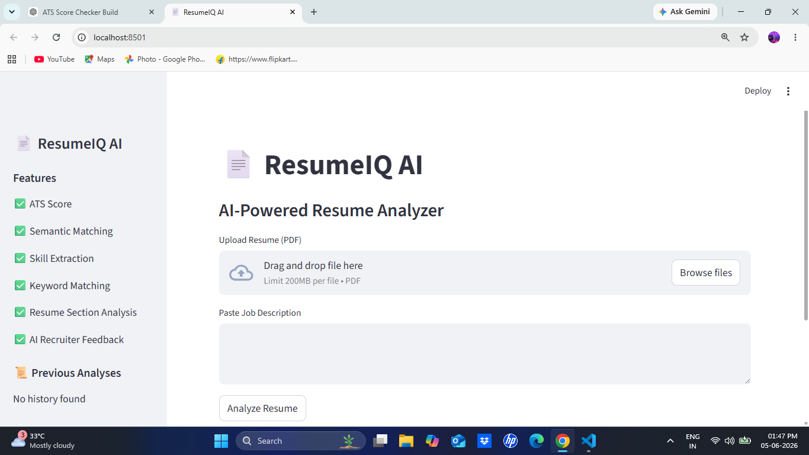
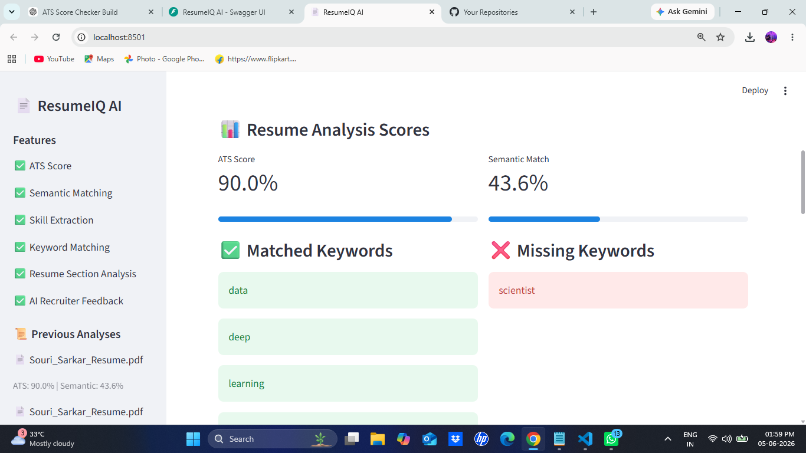
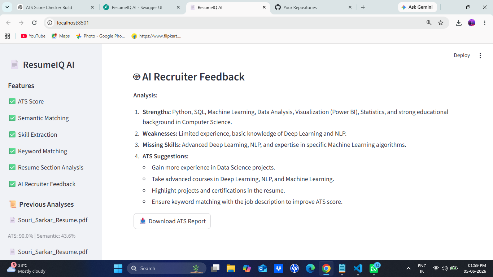
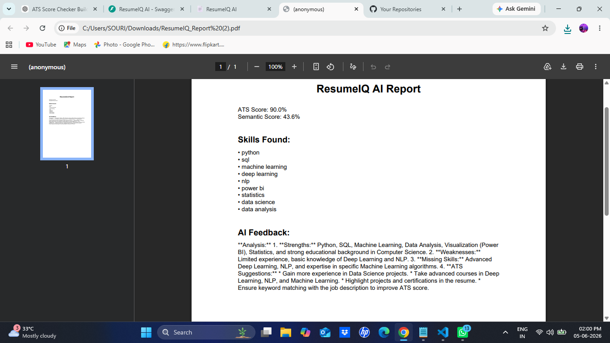

# 📄 ResumeIQ AI

AI-Powered Resume Analyzer that evaluates resumes against job descriptions using ATS scoring, semantic matching, skill extraction, and AI-generated recruiter feedback.

---

## 🚀 Features

### ✅ ATS Score Analysis
- Keyword matching
- ATS compatibility score
- Missing keyword detection

### ✅ Semantic Matching
- Sentence Transformer based similarity
- Resume vs Job Description relevance score

### ✅ Skill Extraction
- Python
- SQL
- Machine Learning
- Deep Learning
- NLP
- Power BI
- Statistics
- Data Science

### ✅ Resume Section Analysis
Detects:

- Education
- Skills
- Experience
- Projects
- Certifications

### ✅ AI Recruiter Feedback
Provides:

- Resume strengths
- Weaknesses
- Missing skills
- ATS improvement suggestions

### ✅ PDF Report Generation
Download complete analysis report as PDF.

### ✅ Analysis History
Stores previous resume analyses.

---

## 🛠 Tech Stack

### Frontend
- Streamlit

### Backend
- FastAPI

### AI / NLP
- Sentence Transformers
- Groq LLM

### Database / Storage
- JSON History Storage

### Other Libraries
- PyMuPDF
- ReportLab
- Requests

---

## 📂 Project Structure

```text
resumeiq-ai/
│
├── backend/
│   ├── main.py
│   ├── history.py
│   └── services/
│       ├── semantic_match.py
│       └── skills.py
│
├── frontend/
│   ├── app.py
│   └── report_generator.py
│
├── analysis_history.json
├── README.md
└── requirements.txt
```

---

## ⚙️ Installation

### Clone Repository

```bash
git clone https://github.com/Souri-Sarkar/resumeiq-ai.git
cd resumeiq-ai
```

### Create Virtual Environment

```bash
python -m venv venv
```

### Activate Environment

Windows:

```bash
venv\Scripts\activate
```

### Install Dependencies

```bash
pip install -r requirements.txt
```

---

## ▶️ Run Backend

```bash
uvicorn backend.main:app --reload
```

Backend URL:

```text
http://127.0.0.1:8000
```

---

## ▶️ Run Frontend

```bash
streamlit run frontend/app.py
```

Frontend URL:

```text
http://localhost:8501
```

---

## 📊 Example Output

- ATS Score
- Semantic Match Score
- Matched Keywords
- Missing Keywords
- Skills Found
- Resume Sections Analysis
- AI Recruiter Feedback
- Downloadable PDF Report

---

## 📌 Future Improvements

- Supabase Integration
- User Authentication
- Resume Ranking System
- Job Recommendation Engine
- Multi-Resume Comparison
- Dashboard Analytics

---

## 👨‍💻 Author

**Souri Sarkar**

Aspiring AI / ML Engineer | Data Science Enthusiast

GitHub:
https://github.com/Souri-Sarkar

## 📸 Screenshots

### Home Page



### Resume Analysis



### AI Recruiter Feedback



### PDF Report

